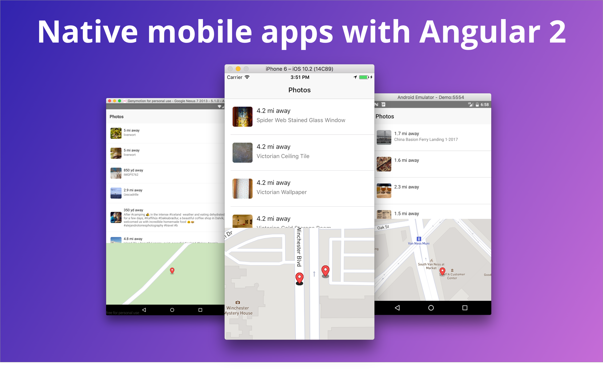
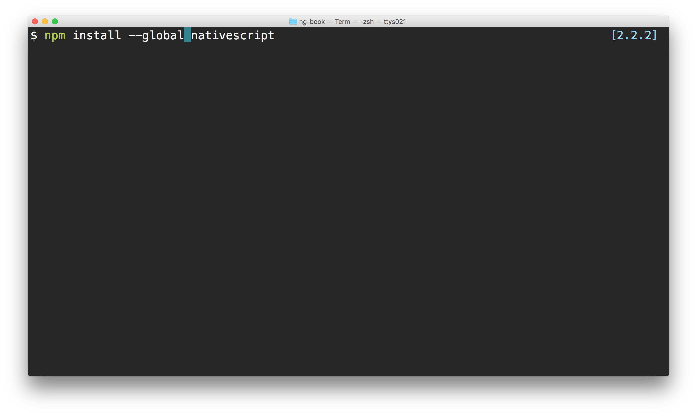
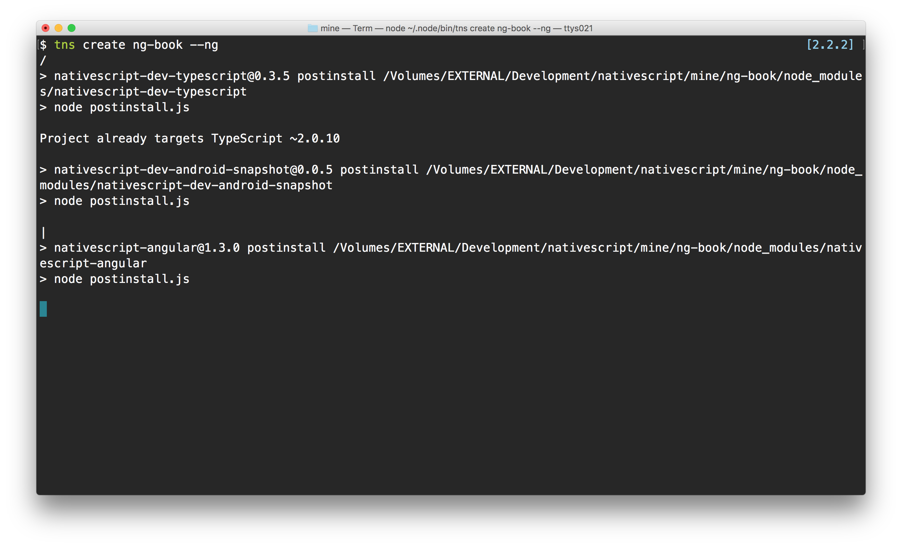
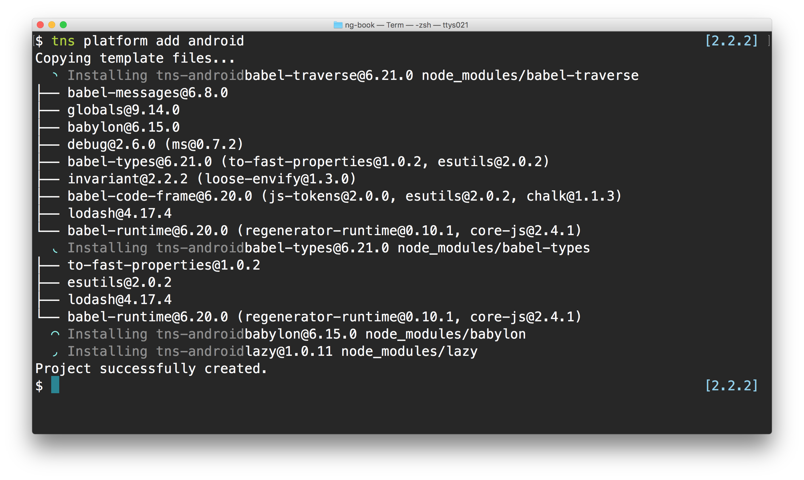
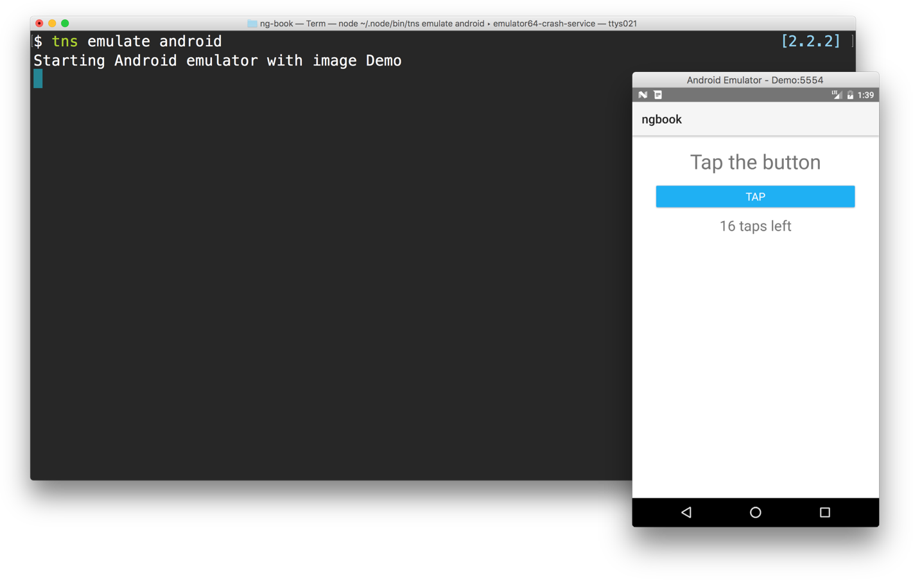
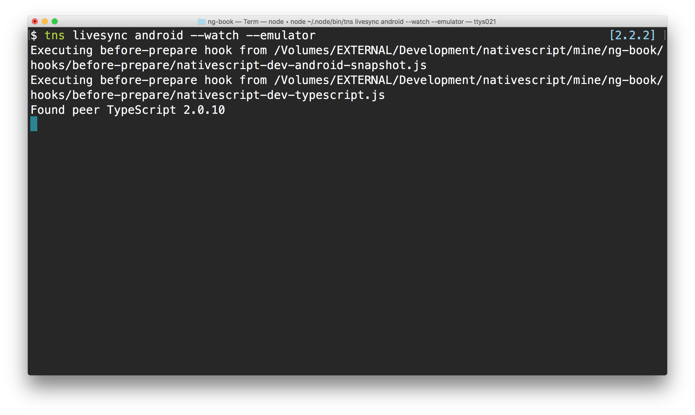
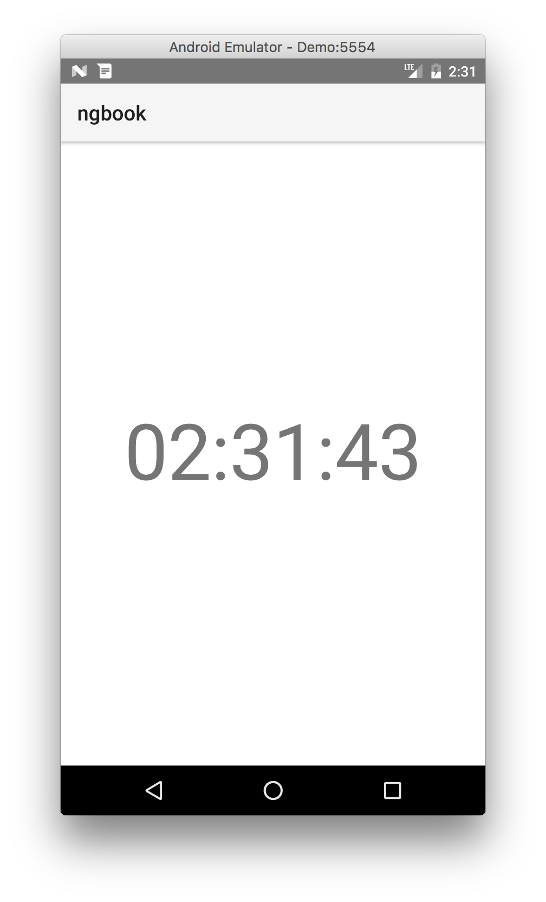

This is a native mobile application written using [NativeScript](https://www.nativescript.org/), [Angular 2](https://angular.io/), and [TypeScript](https://www.typescriptlang.org/) as part of a demo series provided by the guys at [ng-book](http://ng-book.com/2).

## Quickstart

In order to get things working, we'll need to install the quickstart NativeScript helper. Thanks to `npm`, this is pretty simple to do:

```
npm install --global nativescript
```



Now we can use the freshly installed NativeScript binary (`tns`), to bootstrap a new Angular 2 application.

```
tns create ngBook --ng
```



Now, we'll need to add a platform to work with. Since you need a Mac computer to build an iOS app, we'll work with Android (for the purpose of this email -- but the process for building an iOS app is nearly identical, switching out the platform name android for ios).

In order to run on Android, we need to add the android platform to our application. We can do that using the `tns` tool again:

```
tns platform add android
```



Now we can run the application using the `tns` binary:

```
tns emulate android
```



> You'll need to have an Android emulator installed. Check out the [native emulator](https://developer.android.com/studio/run/emulator.html) or [Genymotion](https://www.genymotion.com/) as two possible emulators to use.

Since we'll want to edit our application and have it reload everytime we make a change, we'll use the `livesync` command instead of the `emulate` command:



With our application running, we can now start editing our application. Notice that the structure the `tns` tool created for us is our familiar Angular 2 structure.




## Contributing

There are lots of other little things that need cleaned up such as:

- Add tests
- Make it look pretty!

If you'd like to contribute, feel free to submit a pull request and we'll likely merge it in.

## Getting Help

If you're having trouble getting this project running, feel free to [open an issue](https://github.com/fullstackio/mobile-clock/issues), join us on [Gitter](https://gitter.im/ng-book/ng-book?utm_source=badge&utm_medium=badge&utm_campaign=pr-badge&utm_content=badge), or [email us](mailto:us@fullstack.io)!

___

# ng-book 2

<a href="https://ng-book.com/2">

</a>

This repo was written and is maintained by the [ng-book 2](https://ng-book.com/2) team. In the book we talk about each line of code in this app and explain why it's there and how it works.

This app is only one of several apps we have in the book. If you're looking to learn Angular 2, there's no faster way than by spending a few hours with ng-book 2.

<div style="clear:both"></div>

## License
 [MIT](/LICENSE.md)
